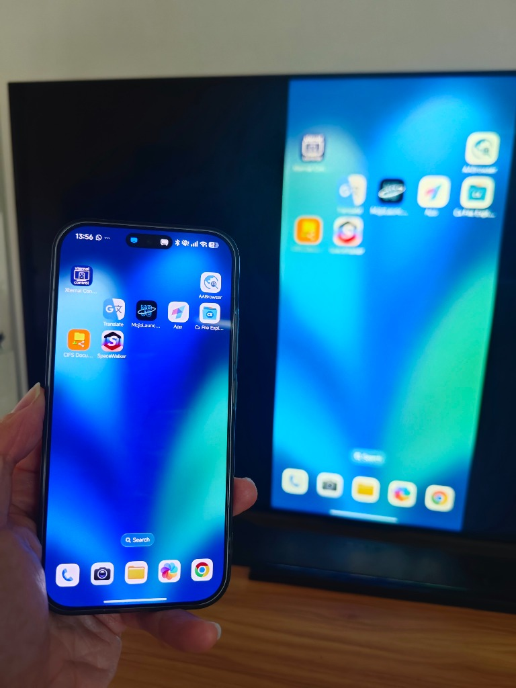
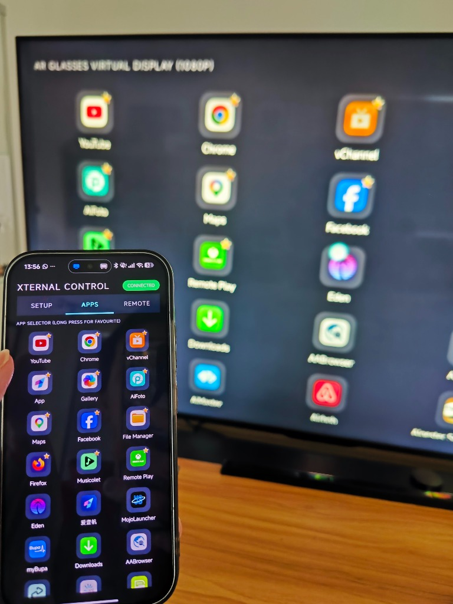
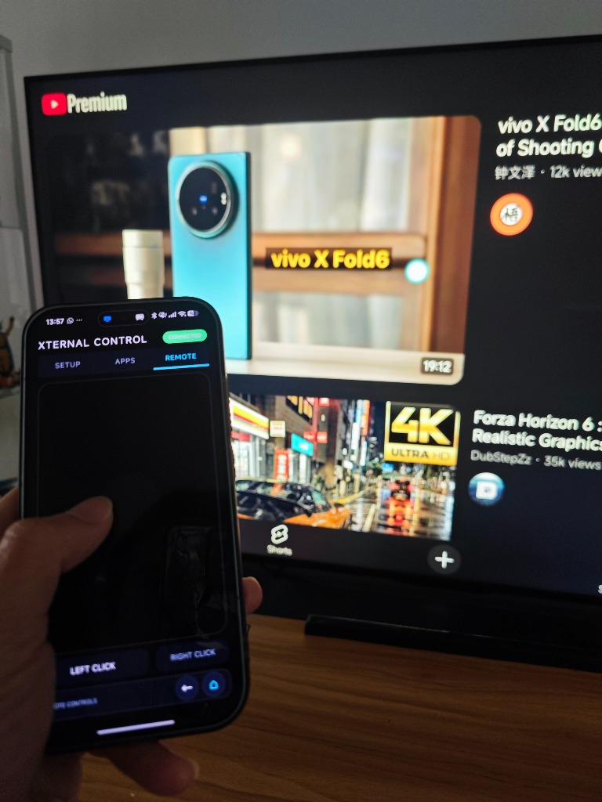
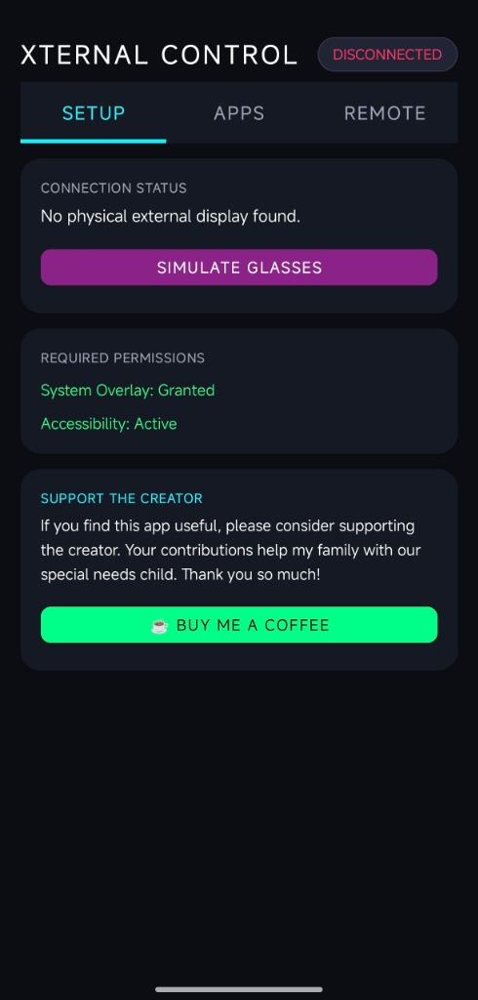
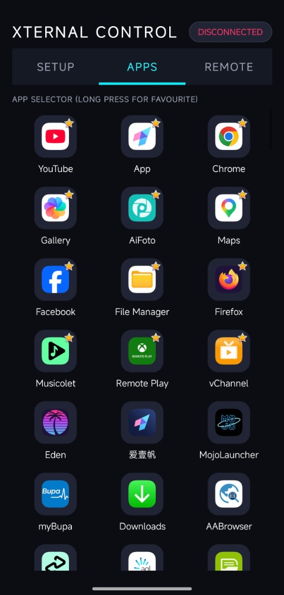
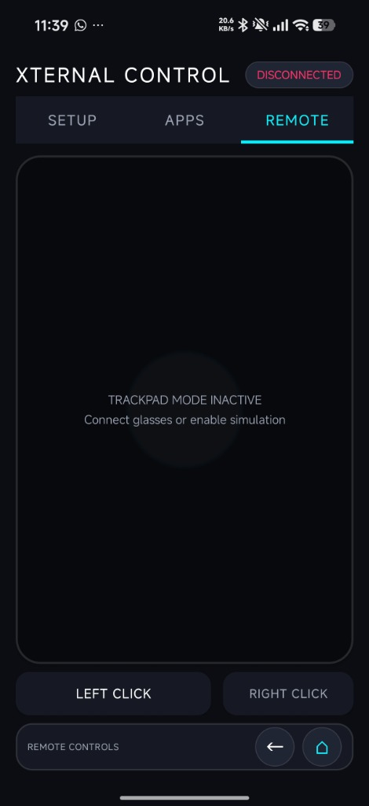
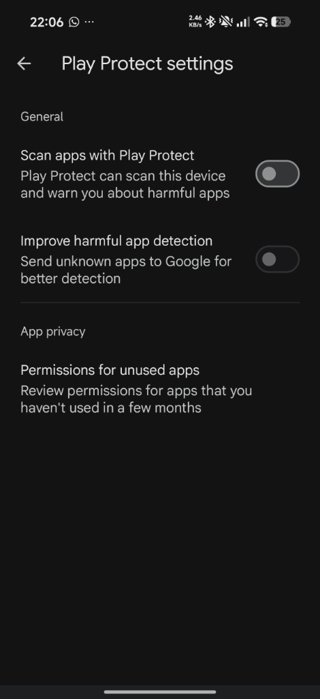
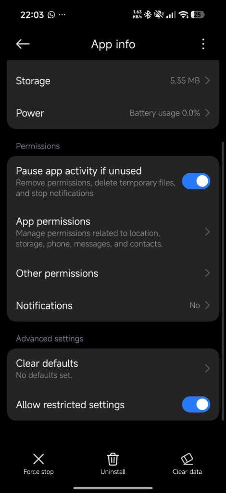

# Xternal Control 📱🕶️

**Xternal Control** is a premium, ad-free, obsidian-themed Android utility application designed to control external displays, projectors, smart AR glasses (like XREAL, Viture), or **wireless screen casts (TVs, Chromecast, Miracast)** using your phone or tablet as a smart trackpad, launcher, and keyboard.

---

## 📺 Why Xternal Control? (The Problem vs. The Solution)

### The Problem: Standard Screen Mirroring
Whenever you cast your Android phone to a big screen, monitor, or AR glasses, it usually mirrors your phone screen's vertical aspect ratio. This results in huge black bars on the left and right, wasting screen real estate. 

Even if you rotate your phone to landscape mode, the resolution and aspect ratio still won't match the glasses. Because modern phones have different aspect ratios (such as 19.5:9, 21:9, or square foldables like the Vivo X Fold) compared to a standard 16:9 screen, the mirrored display ends up letterboxed with black bars on all sides, making the image look much smaller than the glasses' actual display canvas.

Furthermore, existing VR/AR launcher apps (like SpaceWalker) might offer a fullscreen desktop, but they restrict you to their built-in browser or custom apps—you can't select and run *any* third-party app you want.

### The Solution: True Fullscreen Extension
**Xternal Control** treats the external TV, monitor, or XR glasses as an independent **extension monitor** using its native landscape resolution (e.g., 1080p). You get a full, cinematic widescreen experience! Open **any** application installed on your phone on the big screen and control it smoothly using your phone as a high-precision trackpad.

| Standard Mirroring (Black Bars) | Xternal Control (True Widescreen) |
|:---:|:---:|
|  |  |
| Standard portrait mirroring mirrors the aspect ratio | Xternal Control unlocks the native fullscreen resolution |

### Control the External Screen using Phone Trackpad
Once connected, switch to the **REMOTE** tab to turn your phone into a low-latency, high-precision trackpad. Move the cursor, click, scroll, and pinch-to-zoom directly inside any third-party app (like YouTube, Chrome, or maps) running on the big screen.

  
   
  <em>Control the external screen using your phone's trackpad</em>

---

## 🚀 Key Features

* **Dual-State Interaction**:
  - **Physical Mode**: Connect real AR glasses or external monitors and control system-wide applications.
  - **Simulator Mode**: Split your tablet screen side-by-side to test and play with a virtual smart glasses interface locally.
* **Responsive Multi-Tab Controller**:
  - **SETUP**: Easily verify system permissions and manage display connections.
  - **APPS**: Search, sort, and launch installed apps on the glasses display.
  - **REMOTE**: A spacious trackpad grid, dedicated Left/Right click panels, and hardware-style navigation buttons (Back, Home).
* **Multi-Level App Sorting**:
  - **Favourites First**: Long-press any app card to star it. Starred apps bubble to the top of the launcher with a gold star badge.
  - **Chronological Recents**: Recently launched apps automatically list next, sorted by recents first.
  - **Alpha Rest**: All other applications follow alphabetically.
* **Low-Latency Gesture Engine**:
  - Precision trackpad supports cursor movement, vertical/horizontal scrolling, horizontal photo swiping (swapping), and double-tap right clicks.
  - Custom pinch-to-zoom gesture parser triggers native zoom-in/out actions in mapping or web browser applications.
* **Persistent Settings**: Recents, favourites, and settings are preserved across app restarts.
* **Accessibility Integration**: Focuses and injects inputs (clicks, scrolls, navigation commands) directly into third-party apps (e.g., YouTube, Chrome) on physical external screens.

---

## 📸 App Interface

Take control of your external display with our clean, high-contrast three-tab interface:

| 1. SETUP | 2. APPS Launcher | 3. REMOTE Trackpad |
|:---:|:---:|:---:|
|  |  |  |
| Grant overlay & accessibility permissions | Fast search, favorites first, and recent app sorting | Spacious trackpad, left/right clicks, & navigation buttons |

---

## 🛠️ Requirements & Setup

### Permissions Required
Due to its remote control nature, **Xternal Control** requires two key Android permissions:
1. **System Overlay (Draw over other apps)**: Required to render the custom glowing pointer cursor over other applications on the secondary screen.
2. **Accessibility Service**: Required to inject navigation actions (Back, Home) and gestures (clicks, scrolls, pinches) on the secondary display context.

> [!NOTE]
> The app is completely safe. The Accessibility Service is strictly used locally to inject remote input actions on the external display and collects no data.

---

## 📲 Installation

> [!IMPORTANT]
> **Ad-Free and Play Protect Installation Warning**
> * **100% Ad-Free**: This app has absolutely no advertisements, trackers, or hidden fees.
> * **"Install anyway" Warning**: Because this app requires system accessibility control to inject cursor gestures and clicks on your behalf, Google Play Protect might flag it as coming from an "Unknown Developer." During installation, click the details arrow and select **"Install anyway"** to proceed.

1. Download the latest signed package `app-release.apk` from the **Releases** tab.
2. Sideload the APK onto your Android phone or tablet.
3. Open the app, navigate to the **SETUP** tab, and toggle the permissions:
   - Grant **System Overlay**.
   - Enable **Xternal Control** in your system **Accessibility** settings.

### ⚠️ Sideloading & Permission Troubleshooting (Android 13+)

If you install the app from GitHub (sideloaded APK), Android 13+ may block you from enabling the Accessibility permission, showing a **"Restricted setting"** popup. 

| 1. Bypass Play Protect Block | 2. Allow Restricted Settings |
|:---:|:---:|
|  |  |
| **Play Protect Warning**: If the install is blocked, temporarily disable **Scan apps with Play Protect** in your Play Store settings. | **Restricted Setting Greyed Out**: Go to your phone's **Settings > Apps > Xternal Control**, and toggle/tap **"Allow restricted settings"** (found at the bottom or inside the top-right three-dots menu). |

---

## 🕹️ How to Use

### Mode A: Side-by-Side Simulation (Demo Mode)
1. Tap **SIMULATE GLASSES** in the **SETUP** tab.
2. The screen will split: the left side is your controller, the right side is your virtual AR glasses screen.
3. Move your finger on the trackpad to watch the cursor overlay move on the virtual screen.
4. Launch apps (Browser, Notes, Satellite Map) and use clicks, scrolling, and pinch-to-zoom to interact.

### Mode B: Secondary Display & Screen Casting (Active Mode)
1. Connect physical AR glasses/monitor (via USB-C DP Alt Mode, HDMI) **OR** start a **wireless Screen Cast / Wireless Display connection** to your TV or Chromecast.
2. The app badge will update to **CONNECTED** and launch the desktop dashboard overlay on the target display.
3. Navigate to **REMOTE** to control any system application on the casted screen.

---

## 1. Enabling Mirror Mode (Brand Guide)
By default, some devices automatically launch custom desktop interfaces when connected to a monitor or AR glasses. Xternal Control requires standard screen mirroring to function correctly. 

### For Samsung Devices (Disabling DeX)
Samsung phones often launch **Samsung DeX** by default. You need to switch this off to enable Mirror Mode:
1. Connect your phone to the external display using your USB-C cable or adapter.
2. Swipe down from the top of your screen to open the **Quick Settings** panel.
3. Look for the **DeX** icon. If it is highlighted/active, tap it to turn it off.
4. Your external screen will instantly switch from the DeX desktop interface to mirror your exact phone screen.

### For Google Pixel & Other Android Devices
1. Connect your device to the external display.
2. If a system popup asks how you want to use the display, select **Mirror Mode** or **Mirror Screen**.
3. If your phone defaults to an experimental desktop layout, go to **Settings > Connected Devices > Connection Preferences** and ensure the external display configuration is set to mirror.

---

## 2. Enabling Accessibility Permissions (Overlay Cursor)
Because the Xternal Control trackpad relies on an overlay cursor to navigate and control the external monitor, you must grant the app Accessibility permissions.

1. Open your phone's **Settings** app.
2. Scroll down and select **Accessibility**.
3. Tap on **Installed Apps** (or **Downloaded Services** depending on your specific phone model).
4. Find and select **Xternal Control**.
5. Toggle the switch to **On** and confirm the permissions popup.

---

## 3. DRM Workaround (AppleTV, Netflix, etc.)
> ⚠️ **Note:** Due to Digital Rights Management (DRM) restrictions, streaming apps like AppleTV may crash or show a black screen if they detect a persistent overlay cursor from third-party tools. Use the following workaround to bypass this restriction.

1. **Establish Connection**
   Connect your phone to the external screen and ensure it is running in **Mirror Mode**. Make sure you do not see any cursor visible on the external screen yet.
2. **Launch the App**
   Open the **Xternal Control** app on your phone, head to the app selection list, and open your desired streaming app (e.g., AppleTV). The app should load normally.
3. **Navigate Content**
   Use the Xternal Control trackpad interface on your phone to browse and click on the video content you want to watch. 
4. **Allow Cursor to Fade**
   When the video starts playing, the external screen may momentarily turn black because it detects the active overlay cursor. **Do not touch the trackpad.** After **5 seconds of inactivity**, the overlay cursor will automatically disappear, and your video content will immediately reappear on the display.

---

## ❓ FAQ (Frequently Asked Questions)

#### Q: Why does Google Play Protect show a warning during installation?
**A:** Since **Xternal Control** is a sideloaded APK (not yet published on the Google Play Store), Google flags it as being from an "Unknown Developer." Furthermore, because the app requires Android's Accessibility Services to inject cursor clicks and gestures on your behalf, it requests elevated system permissions. The app is completely safe and ad-free. During installation, click the details dropdown and select **"Install anyway"** to proceed.

#### Q: Do I need to be rooted to use this?
**A:** No, root access is not required! The app utilizes standard Android System Overlay and Accessibility Service APIs to display the cursor and simulate touches on the external display.

#### Q: Can I run *any* application on my external screen?
**A:** Yes! Unlike proprietary AR/VR launchers (such as SpaceWalker) which restrict you to their custom browsers and media players, Xternal Control allows you to launch and run any third-party app installed on your device (e.g., YouTube, Chrome, maps, games, etc.) in true widescreen.

#### Q: How do I connect to my TV or AR Glasses?
**A:** You can connect in two ways:
1. **Wired Connection**: Plug in your smart AR glasses (XREAL, Viture, Rokid) or external monitor via USB-C DisplayPort (DP Alt Mode) or HDMI.
2. **Wireless Connection**: Start a screen cast or wireless display mirroring connection to your TV, Chromecast, or Miracast receiver. The app will automatically capture the widescreen canvas.

#### Q: Why is my trackpad not moving the cursor or clicking?
**A:** Please double-check that you have granted both permissions under the **SETUP** tab:
1. **System Overlay** (allows the cursor to draw on top of other apps).
2. **Accessibility Service** (allows the app to simulate click, scroll, and pinch-to-zoom gestures). If accessibility becomes inactive, toggle it OFF and ON again in your Android System Settings.

#### Q: Is the app really free and ad-free?
**A:** Yes, it is 100% free, has zero ads, and collects no data. If you enjoy using it, you can optionally support the developer's family (who raise a special needs child) via [Buy Me a Coffee](https://buymeacoffee.com/akworkshop).

---

## ☕ Support the Creator

If you find this project useful, please consider supporting the creator! Your contributions help support my family with our special needs child.

* **Buy Me a Coffee**: [buymeacoffee.com/akworkshop](https://buymeacoffee.com/akworkshop)

---

## 📄 License
This project is open source and available under the [MIT License](LICENSE).
