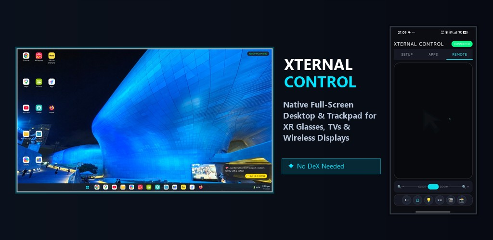
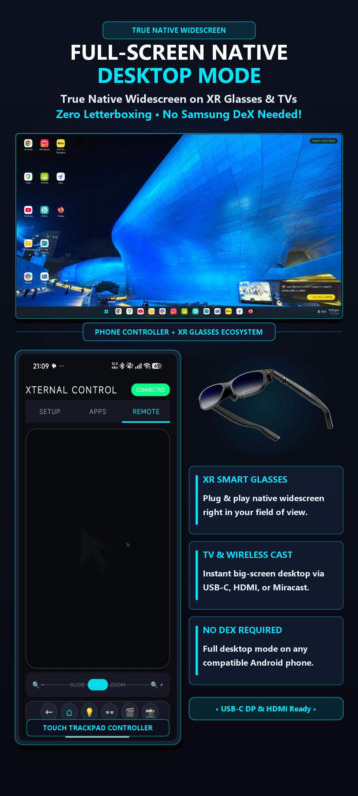
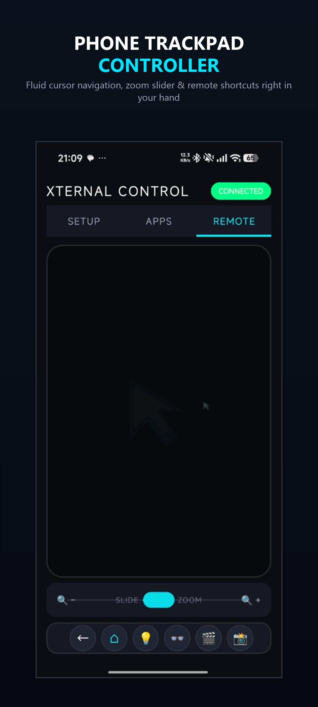
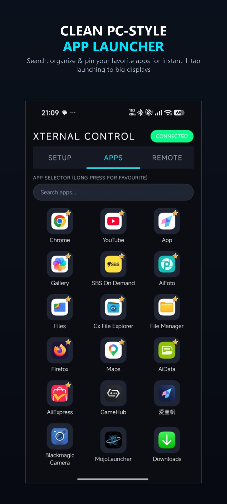
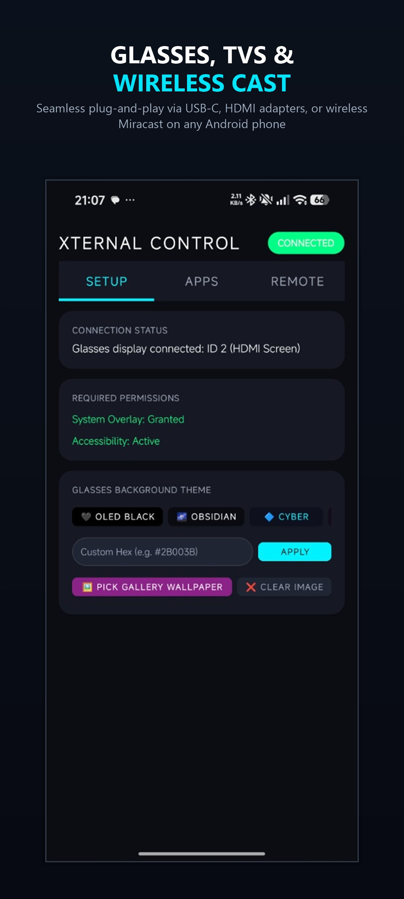
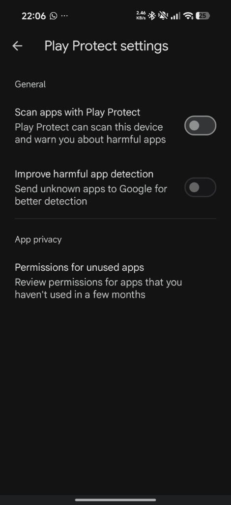
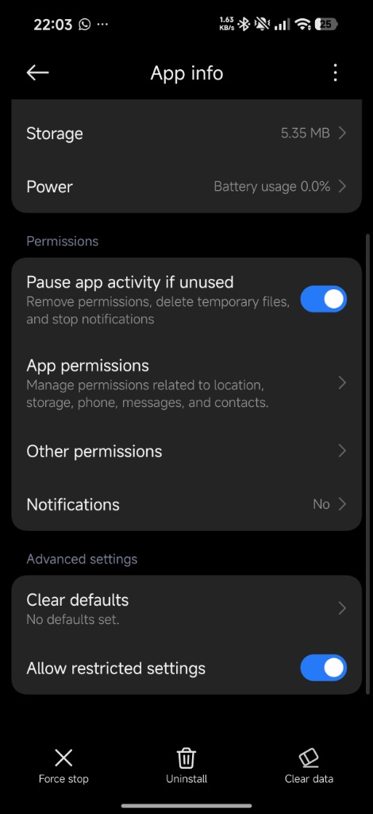

  

  
  
  
  

# Xternal Control 📱🕶️

**Xternal Control** transforms any Android phone or tablet into a native full-screen desktop experience and smart touch trackpad for **Smart XR Glasses** (XREAL, Viture, Rokid, RayNeo), **External Monitors**, **Projectors**, and **Wireless Displays (TVs, Chromecast, Miracast)**.

No Samsung DeX required — get a full PC-style desktop, taskbar, start menu, and precision trackpad controller on **any** Android device.

---

## 📺 Why Xternal Control? (The Problem vs. The Solution)

### The Problem: Standard Screen Mirroring
Whenever you cast your Android phone to XR glasses or an external TV, standard screen mirroring duplicates your phone screen's vertical aspect ratio. This leaves huge black bars on the left and right, severely wasting screen space.

Even if you rotate your phone to landscape mode, modern phones use tall aspect ratios (19.5:9, 20:9, 21:9, or square foldables like the Vivo X Fold) compared to standard 16:9 displays. The result is a letterboxed image with black borders on all four sides, making the picture appear tiny inside your glasses or TV.

Furthermore, proprietary XR/VR launcher apps restrict you to their built-in web browser or custom players — you cannot run your actual installed Android apps.

### The Solution: True Native Widescreen Desktop
**Xternal Control** utilizes the native 16:9 resolution (1080p, 2K, or 4K) of your external screen or XR glasses, giving you an expansive, cinematic desktop canvas. Launch **any** app installed on your phone in widescreen, and control everything smoothly with your phone as a high-precision trackpad.

  

---

## 📸 Interface & Capabilities

| 1. Full-Screen Desktop | 2. Precision Trackpad |
|:---:|:---:|
|  |  |
| **Native 16:9 Widescreen Desktop** Desktop icons, Start Menu, taskbar, system tray with hardware resolution detection. | **High-Precision Trackpad** Low-latency cursor control, continuous zoom slider, click zones, and remote navigation. |

| 3. Clean App Launcher | 4. Themes & Custom Wallpapers |
|:---:|:---:|
|  |  |
| **PC-Style Start Menu & Launcher** Instant app search, favorite pinning, and chronological recents sorting. | **Customization & Display Setup** OLED Pitch Black, Obsidian, Cyber themes, custom hex colors, or custom gallery wallpapers. |

---

## 🚀 Key Features

* 🖥️ **Full-Screen Desktop Mode**:
  * **Zero Letterboxing**: Automatically detects native external display resolution (1080p, 2K, 4K) and fills the entire 16:9 canvas.
  * **PC Desktop Experience**: Familiar desktop icon grid, Windows-style Start Menu with instant search, and a persistent taskbar.
  * **System Tray**: Real-time battery indicator, digital clock, date, and active resolution badge.
* 🖱️ **Phone Trackpad Controller**:
  * **Fluid Cursor Movement**: Low-latency cursor rendering with custom neon arrow pointer.
  * **Intuitive Gestures**: Tap to click, double-finger scrolling, horizontal photo swiping, and pinch-to-zoom simulation.
  * **Continuous Zoom Slider**: Smooth zoom-in and zoom-out slider for maps, documents, and web pages.
  * **Remote Shortcuts**: Dedicated hardware-style navigation (Back, Home), cursor mirror toggle, and quick display dimming.
  * **Smart DRM Auto-Fade**: The cursor automatically disappears after 5 seconds of inactivity so video streams (Apple TV, Netflix, Prime Video) play without DRM black screens.
* 📌 **Smart App Organization**:
  * **Pinned Favorites**: Star your favorite apps to pin them to the external Desktop and Taskbar for quick 1-tap launching.
  * **Recents First**: Automatically sorts recently used apps right after your favorites.
  * **Instant Search**: Quickly filter through all installed applications directly from your phone or the external start menu.
* 🎨 **Display Background Themes**:
  * **OLED Black**: Pitch-black canvas for XR glasses to maximize transparency and battery savings.
  * **Obsidian & Cyber**: Sleek, high-contrast dark themes.
  * **Custom Hex Color & Photo Wallpaper**: Set any custom background color or select your own photo from your device's photo gallery.
* 🔌 **Universal Compatibility (No DeX Needed)**:
  * Works on **any** Android phone with USB-C DP Alt Mode or HDMI (Vivo, Google Pixel, OnePlus, Xiaomi, Motorola, Sony, Samsung).
  * Seamless support for **Smart XR Glasses** (XREAL Air / Air 2 / One, Viture One / Pro, Rokid Max, RayNeo Air).
  * Compatible with portable monitors, HDMI TVs, projectors, and **wireless screen casting** (Miracast, Chromecast, smart TVs).

---

## 🛠️ Requirements & Setup

### Permissions Required
Because **Xternal Control** acts as a remote trackpad and launcher for external screens, two Android permissions are required:
1. **System Overlay (Display over other apps)**: Allows the glowing cursor pointer to be drawn smoothly over applications on the secondary screen.
2. **Accessibility Service**: Allows the trackpad to simulate mouse clicks, scrolls, zooms, and system navigation (Back / Home) inside third-party apps on the external display.

> [!NOTE]
> **Privacy First**: Xternal Control collects zero user data and has no network tracking. The Accessibility Service is used exclusively on your local device to inject cursor touch events onto the external screen.

---

## 📲 Installation

1. Download the latest release **[app-release-v1.2.2.apk](app-release-v1.2.2.apk)** from the [Releases](../../releases) page.
2. Install the APK on your Android device.
3. Open **Xternal Control**, go to the **SETUP** tab, and toggle the required permissions:
   - Grant **System Overlay**.
   - Enable **Xternal Control** in **Accessibility Settings**.

### ⚠️ Sideloading & Permission Troubleshooting (Android 13+)

If installing from GitHub (sideloaded APK), Android 13+ may show a **"Restricted setting"** dialog when enabling Accessibility:

| 1. Play Protect Warning | 2. Restricted Settings (Android 13+) |
|:---:|:---:|
|  |  |
| If prompted by Google Play Protect, tap **"More details"** and select **"Install anyway"**. | Go to your phone's **Settings > Apps > Xternal Control**, tap the **three-dots menu** (top-right), and select **"Allow restricted settings"**. |

---

## 🕹️ Quick Start Guide

### 1. Connecting Your Screen
* **Wired (XR Glasses / Monitor)**: Connect your glasses or external monitor using USB-C (DisplayPort Alt Mode) or an HDMI adapter.
* **Wireless (Smart TV / Chromecast)**: Start a screen cast / Smart View / Wireless Display mirroring session to your TV.
* Once connected, the app status badge will switch to **CONNECTED** and launch the desktop environment on your secondary display.

### 2. Brand Settings (Enabling Mirror Mode)
* **Samsung Phones (Disabling DeX)**: If your Samsung phone automatically launches Samsung DeX, pull down the **Quick Settings** shade and tap the **DeX** toggle to turn it off. Xternal Control provides its own native desktop with custom trackpad integration.
* **Google Pixel & Other Phones**: When prompted upon plugging in, select **Mirror Mode** or standard screen mirroring.

### 3. DRM Video Workaround (Netflix, Apple TV, Prime)
> 💡 **Tip:** Streaming platforms with DRM protection may blank the video if an overlay cursor is continuously detected.
* Simply navigate to and start playing your video using the trackpad.
* **Release the trackpad**: After **5 seconds of inactivity**, the overlay cursor will automatically fade away, and your video stream will play uninterrupted in full widescreen!

---

## ❓ FAQ (Frequently Asked Questions)

#### Q: Do I need root access?
**A:** No, root is not required. The app uses standard Android Accessibility and Window Manager APIs.

#### Q: Does it work with my phone?
**A:** Yes! As long as your phone supports video output over USB-C (DisplayPort Alternate Mode) or wireless screen casting (Miracast / Google Cast), Xternal Control works out of the box.

#### Q: How does this differ from Samsung DeX?
**A:** DeX is exclusively restricted to flagship Samsung Galaxy devices and doesn't run on Pixel, Vivo, Xiaomi, OnePlus, or Motorola phones. Xternal Control brings a full-screen desktop mode, XR glasses optimization (OLED transparency theme), and a smart phone-trackpad to **all** Android devices.

#### Q: Can I run any app on the external screen?
**A:** Yes! You can launch Chrome, YouTube, media players, file managers, office suites, and games directly on the big screen.

---

## ☕ Support the Creator

If you find Xternal Control helpful, please consider supporting the creator. Your contributions help support my family with our special needs child. Thank you so much!

* **Buy Me a Coffee**: [buymeacoffee.com/akworkshop](https://buymeacoffee.com/akworkshop)

---

## 📄 License
This project is open source and available under the [MIT License](LICENSE).
